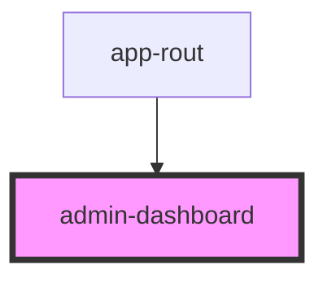

# admin-dashboard

<!-- Auto Generated Below -->

## Properties

| Property  | Attribute | Description | Type      | Default     |
| --------- | --------- | ----------- | --------- | ----------- |
| `btn`     | `btn`     |             | `boolean` | `undefined` |
| `open`    | `open`    |             | `boolean` | `undefined` |
| `product` | `product` |             | `boolean` | `undefined` |

## Dependencies

### Used by

 - [app-rout](../app-rout)

### Graph

----------------------------------------------

*Built with [StencilJS](https://stenciljs.com/)*
